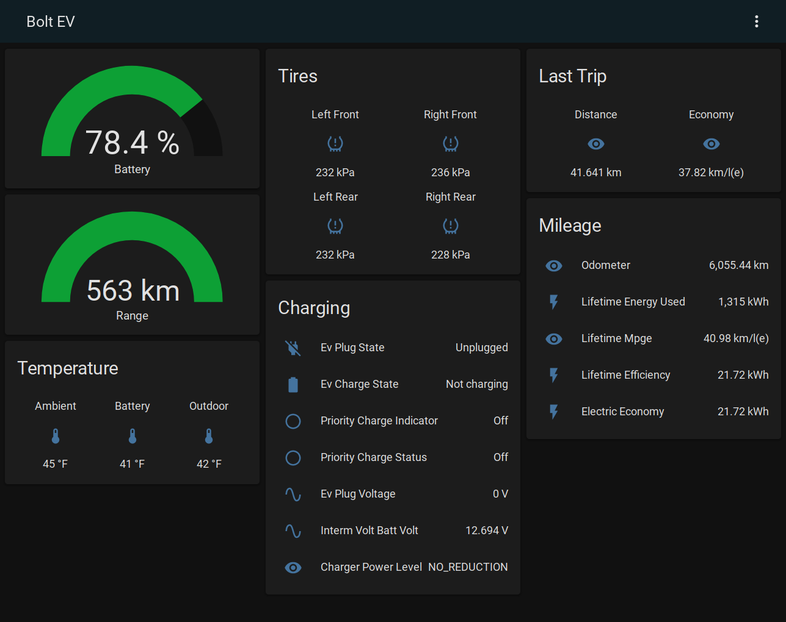

Sample configs for MQTT Home Assistant integration.

### Commands

#### example script yaml:
```yaml
alias: Car - Start Vehicle
sequence:
  - service: mqtt.publish
    data:
      topic: homeassistant/YOUR_CAR_VIN/command
      payload: '{"command": "startVehicle"}'
mode: single
icon: 'mdi:car-electric'
```

#### Triger precondition via calendar
````yaml
alias: Car Precondition
description: Precondition if group.family is home (ie, at least one person).
trigger:
  - platform: state
    entity_id: calendar.YOUR_CAL_NAME
    from: 'off'
    to: 'on'
condition:
  - condition: state
    entity_id: group.family
    state: home
  - condition: state
    entity_id: calendar.YOUR_CAL_NAME
    state: Bolt Start
    attribute: message
action:
  - service: script.car_start_vehicle
    data: {}
mode: single
````

### Location
Unfortunately, the MQTT Device tracker uses a home/not_home state and the MQTT Json device tracker does not support
the discovery schema so a manual entity configuration is required.

device tracker yaml:
```yaml
device_tracker:
  - platform: mqtt_json
    devices:
      your_car_name: homeassistant/device_tracker/YOUR_CAR_VIN/getlocation/state
```

#### script yaml:
```yaml
alias: Car - Location
sequence:
  - service: mqtt.publish
    data:
      topic: homeassistant/YOUR_CAR_VIN/command
      payload: '{"command": "getLocation"}'
mode: single
icon: 'mdi:map-marker'
```
### Automation:
Create an automation to update the location whenever the odometer changes, instead of on a time interval.
```alias: Update EV Location
description: ""
trigger:
  - platform: state
    entity_id:
      - sensor.odometer_mi
condition: []
action:
  - service: script.locate_bolt_ev
    data: {}
mode: single
```

#### Commands:
[OnStarJS Command Docs](https://github.com/samrum/OnStarJS#commands)
1. `getAccountVehicles`
2. `startVehicle`
3. `cancelStartVehicle`
4. `alert`
5. `cancelAlert`
6. `lockDoor`
7. `unlockDoor`
8. `chargeOverride`
9. `cancelChargeOverride`
10. `getLocation`


### Lovelace Dashboard
Create a new dashboard, or use the cards in your own view. The `mdi:car-electric` icon works well here.



#### dashboard yaml:
```yaml
views:
  - badges: []
    cards:
      - type: gauge
        entity: sensor.ev_battery_level
        min: 0
        max: 100
        name: Battery
        severity:
          green: 60
          yellow: 40
          red: 15
      - type: gauge
        entity: sensor.ev_range
        min: 0
        max: 420
        name: Range
        severity:
          green: 250
          yellow: 150
          red: 75
      - type: glance
        entities:
          - entity: sensor.tire_pressure_left_front
            name: Left Front
            icon: 'mdi:car-tire-alert'
          - entity: sensor.tire_pressure_right_front
            name: Right Front
            icon: 'mdi:car-tire-alert'
          - entity: sensor.tire_pressure_left_rear
            name: Left Rear
            icon: 'mdi:car-tire-alert'
          - entity: sensor.tire_pressure_right_rear
            name: Right Rear
            icon: 'mdi:car-tire-alert'
        columns: 2
        title: Tires
      - type: entities
        title: Mileage
        entities:
          - entity: sensor.lifetime_mpge
          - entity: sensor.lifetime_efficiency
          - entity: sensor.electric_economy
        state_color: true
        footer:
          type: 'custom:mini-graph-card'
          entities:
            - entity: sensor.odometer
            - entity: sensor.lifetime_energy_used
              y_axis: secondary
              show_state: true
          hours_to_show: 672
          group_by: date
          decimals: 0
          show:
            graph: bar
            name: false
            icon: false
      - type: entities
        entities:
          - entity: binary_sensor.ev_plug_state
            secondary_info: last-changed
          - entity: binary_sensor.ev_charge_state
            secondary_info: last-changed
          - entity: binary_sensor.priority_charge_indicator
          - entity: binary_sensor.priority_charge_status
          - entity: sensor.ev_plug_voltage
          - entity: sensor.interm_volt_batt_volt
          - entity: sensor.charger_power_level
        title: Charging
        state_color: true
      - type: 'custom:mini-graph-card'
        entities:
          - entity: sensor.last_trip_total_distance
          - entity: sensor.last_trip_electric_econ
            y_axis: secondary
            show_state: true
        name: Last Trip
        hours_to_show: 672
        group_by: date
        agreggate_func: null
        show:
          graph: bar
          icon: false
      - type: 'custom:mini-graph-card'
        entities:
          - entity: sensor.ambient_air_temperature
            name: Ambient
          - entity: sensor.hybrid_battery_minimum_temperature
            name: Battery
          - entity: sensor.kewr_daynight_temperature
            name: Outdoor
        name: Temperature
        hours_to_show: 24
        points_per_hour: 1
        line_width: 2
      - type: grid
        cards:
          - type: button
            tap_action:
              action: toggle
            entity: script.car_start_vehicle
            name: Start
            show_state: false
          - type: button
            tap_action:
              action: toggle
            entity: script.car_cancel_start_vehicle
            name: Cancel Start
            show_state: false
            icon: 'mdi:car-off'
          - type: button
            tap_action:
              action: toggle
            entity: script.car_lock_doors
            name: Lock
            show_state: false
            icon: 'mdi:car-door-lock'
          - type: button
            tap_action:
              action: toggle
            entity: script.car_unlock_doors
            name: Unlock
            show_state: false
            icon: 'mdi:car-door'
        columns: 2
title: Bolt EV
```
